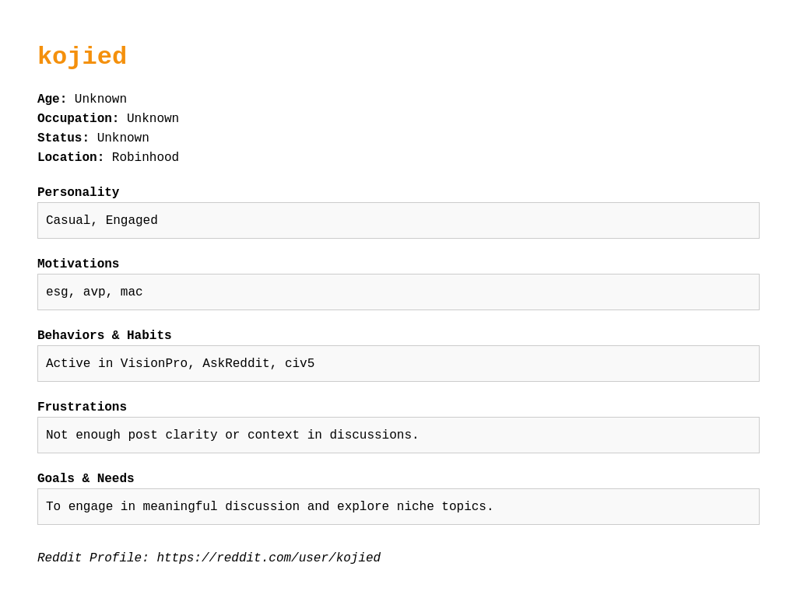

#  Reddit Persona Generator  
Generate PDF and PNG user personas based on Reddit profiles — powered by Python, NLP, and smart UX automation.

---

##  What It Does

**Reddit Persona Generator** is an end-to-end system that:
- Scrapes a user's Reddit posts and comments
- Uses NLP to extract behavioral and personality signals
- Renders a visual persona card (like those used in UX and marketing)
- Exports the result as a **PDF** and **PNG** — ready to present or include in reports

> 🔍 This project blends data scraping, natural language analysis, and design automation.

---

## Sample Output

<div align="center">
  
</div>

> Auto-generated persona PDF/PNG from any Reddit profile.

---

## What You'll Learn From This Repo

- How to turn noisy social data into structured user insights
- How to apply NLP for behavior and personality inference
- How to design data → insight → visualization workflows
- How to use Reddit API, templating, and HTML-to-PDF/PNG exports

---

## Key Features

✅ Scrapes Reddit posts & comments  
✅ Detects age, location, interests, and tone  
✅ Highlights motivations, frustrations, and habits  
✅ Beautiful persona layout (HTML → PDF & PNG)  
✅ Works in **Colab** (no install) or locally

---

## Built With

- **Python 3.10**
- [`PRAW`](https://praw.readthedocs.io/) – Reddit API
- [`spaCy`](https://spacy.io/) – NLP pipeline
- `Jinja2` – HTML templating
- `WeasyPrint` – HTML to PDF
- `imgkit` + `wkhtmltoimage` – HTML to PNG
- **Google Colab** – Zero-setup notebook environment

---

## How to Use

### Run on Colab 

> [🔗 Open in Colab](https://colab.research.google.com/...) ← *(replace with your actual Colab link)*

1. Paste a Reddit profile URL (e.g. `https://www.reddit.com/user/kojied`)
2. Let the tool generate a persona
3. Download the **PDF** and **PNG** persona files

---

## Reddit API Setup (for local use)

1. Go to: [https://www.reddit.com/prefs/apps](https://www.reddit.com/prefs/apps)
2. Scroll down → click **Create App**
3. Fill in:
   - **Name:** e.g. `RedditPersonaApp`
   - **Type:** `script`
   - **Redirect URI:** `http://localhost:8080`
4. After creation, note down:
   - `client_id` (under the app name)
   - `client_secret` (shown as "secret")
   - Define your own `user_agent` (e.g., `user-persona-generator by u/YourUsername`)

```python
# Example usage in code
reddit = praw.Reddit(
    client_id="YOUR_CLIENT_ID",
    client_secret="YOUR_CLIENT_SECRET",
    user_agent="user-persona-generator by u/YOUR_USERNAME"
)
